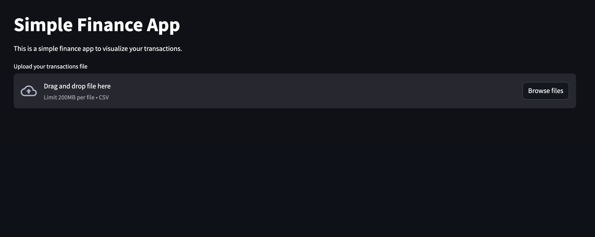
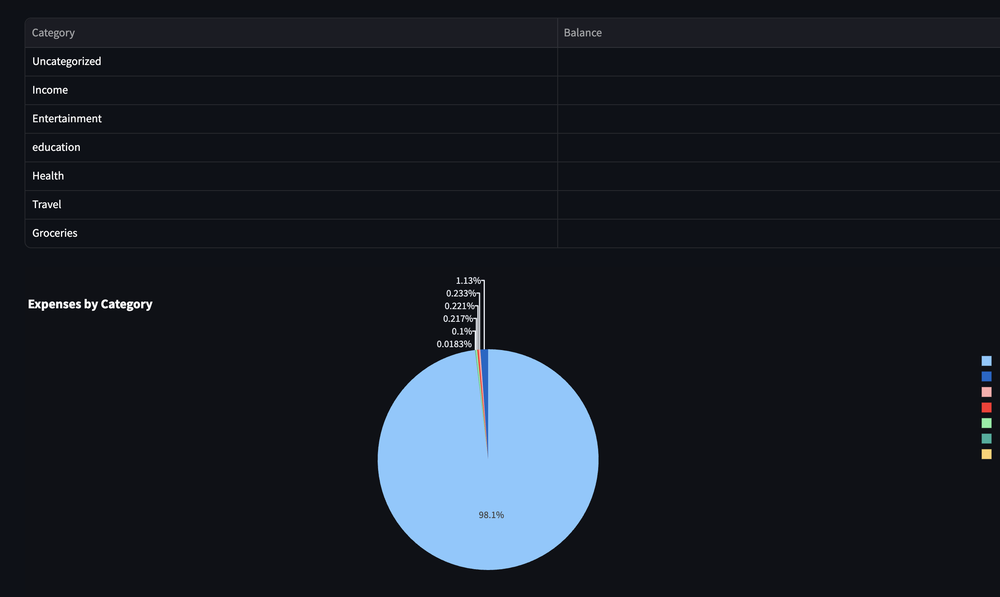
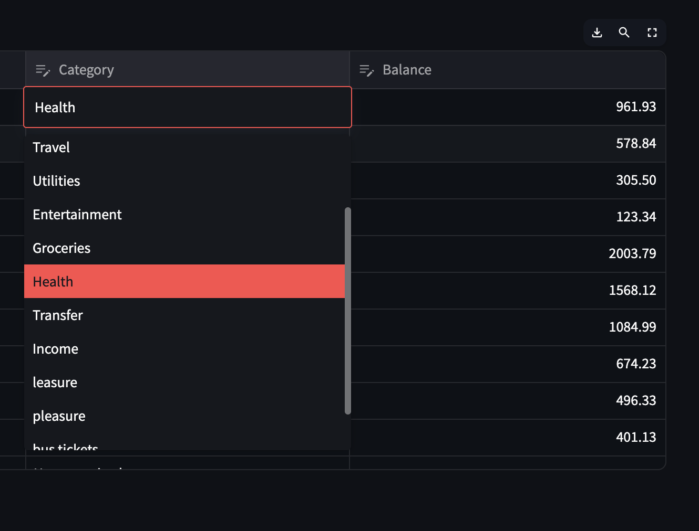

FINANCEAPP

A personal finance tracker and expense management application built with Streamlit,pandas,plotly that helps you monitor your spending, categorize expenses, and gain insights into your financial habits.
It's designed to help individuals gain better control over their finances by providing clear insights into spending patterns.

Prerequisites
 >Python 3.8 or higher
 >Git (for cloning the repository)

🚀 How to Run the App
After completing the setup, you can run the application using Streamlit:
bash 
streamlit run main.py

✨ Features

Expense Tracking: Record and monitor your daily expenses
Categorization: Organize expenses into customizable categories
Financial Dashboard: View your financial summary at a glance
Data Visualization: Understand your spending patterns through charts and graphs
Data Editor: Edit and update your expense records easily
Session Management: Persistent data storage between sessions
Export Functionality: Export your financial data for external analysis
Responsive Design: Works on both desktop and mobile devices

🔄 Updates
The application is regularly updated with new features and improvements. Check back for updates or follow the repository.

📝 License
This project is licensed under the MIT License - see the LICENSE file for details.

👥 Contributing
Contributions are welcome! Please feel free to submit a Pull Request.
